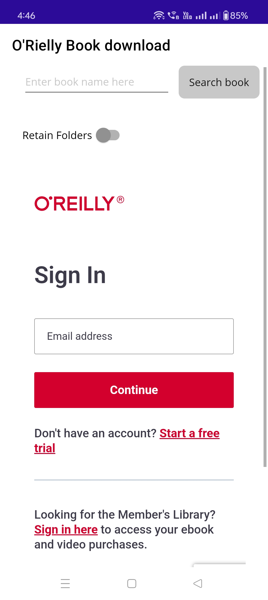
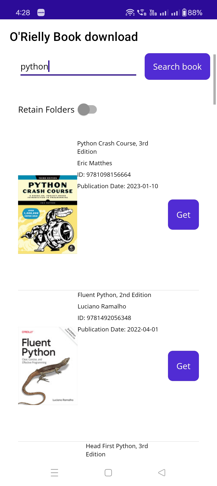
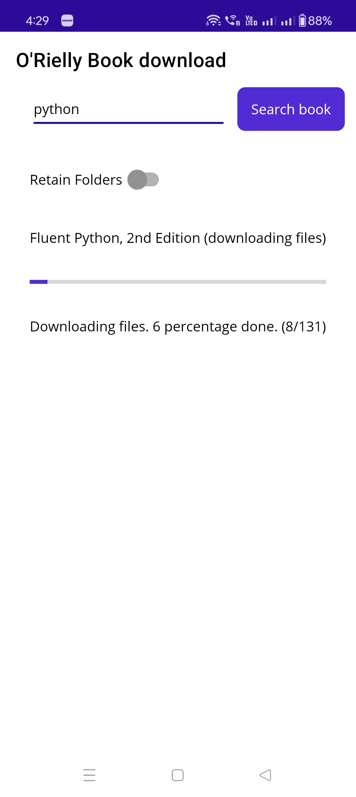
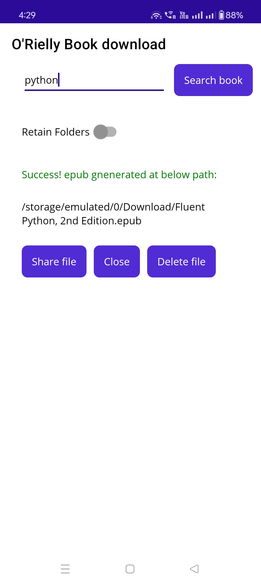

# Gets epub fiels for Kindle from SafariBooks.
- Utilizes V2 APIs.
- Search book functionality built right into the application.
- MAUI project that makes this a multi platform application. Works on Android and Windows.
- Downlads content file in parallel. 
- Shows a login page to avoid fuss around cookies that is present in most of the other projects.
- Does not have problem of not downloading images referred in CSS files.
- Gets original table of contents.
- Corrects "display: none" problem when sending to kindle.
- Corrects/adjusts (to their correct relative path in epub) image paths in css.
- Does not have the problem of fonts not downloading.
- Injects "override_v1.css" to every file.
- Download resumes from where it stopped.
- Share button is now built into the application allowing users to share the file to other applications like OneDrive, Kindle, Google Drive etc. 

### Here are some screen clippings: 

Here is how the login page looks like:

Here is how the Search screen looks like: 

Here is how the download progress screen looks like: 

Here is how the success page with Share to other applications and delete button looks like: 

